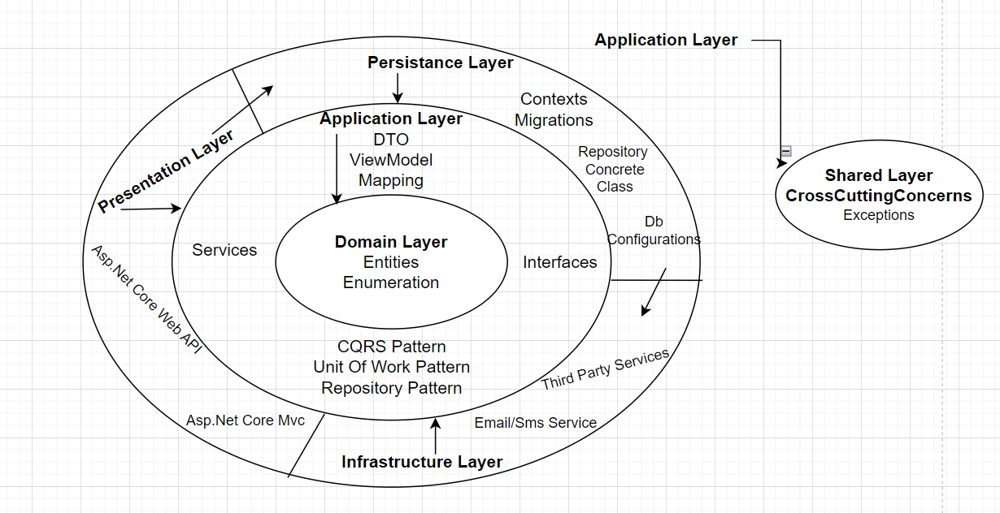

<h1>CarBook Hire A Car Project</h1>

Carbook is a car rental website. Users can rent a car at affordable prices in any location they want, read the blog posts of people who have rented it before, and get detailed information about the vehicles. It performs all these operations with a user-friendly interface and a reliable backend service.

<h3>1. Used Technologies:</h3>
Asp.Net Core 8 API, Asp.Net 8.0 Mvc , EntityFrameworkCore, Onion Architecture,
Generic Repository Design Pattern, CQRS Design Pattern, UnitOfWork Design Pattern,AutoMapper,JWT,Redis Caching,Dtos,Swagger,Postman   

<h3>2. General Outlines of the Architecture Used in the Project</h3>

<h3>3. Language and Development Environment Used: C# - Asp.Net Core 8.0</h3>

<b>Note:</b> The application is currently under development, some of the technologies in question may not have been implemented yet. It will be implemented as soon as possible.
